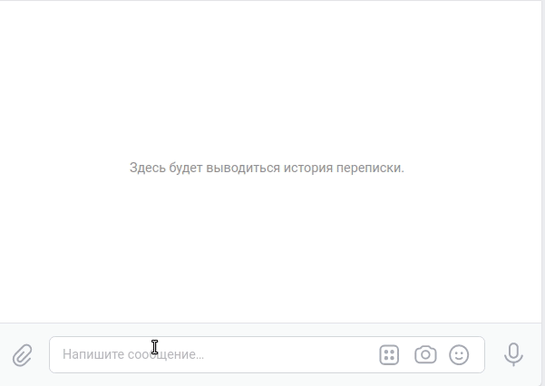

Этот проект бота под Телеграмм и ВК для игры в quiz. 

## Пример общения телеграмм бота.


## Пример общения VK бота.



## Готовых ботов вы можете протестировать по ссылкам:
* telegram - @@questions_159_bot
* vk_bot - [https://vk.com/](https://vk.com/im?sel=-219590143)

## Проект содержит 4е скрипта:
* `vk_bot.py` - Скрипт проверяет полученные сообщения в чате группы ВК, 
  после написания команды "Старт" присылает набор кнопок и вопрос, вы 
  обратным сообщением присылаете ответ, либо выбираете следующую команду 
  нажатие на одну из кнопок.
* `tg_bot.py` - Скрипт проверяет полученные сообщения в чате TG бота, 
  после написания команды "/start" присылает набор кнопок и вопрос, вы 
  обратным сообщением присылаете ответ, либо выбираете следующую команду 
  нажатие на одну из кнопок.
    
* `fetch_questions.py` - Скрипт рандомно выбирает файл, а в указанном файле 
  вопрос, по переданному пути.
* `logs_handler.py` - Скрипт содержит вспомогательный хендлер для отправки 
  логов с ошибками в telegram.

## Установка

Используйте данную инструкцию по установке этого скрипта

1. Установить

```python
git clone https://github.com/Maxim-Pekov/quiz-bot.git
```

2. Создайте виртуальное окружение:

```python
python -m venv venv
```

3. Активируйте виртуальное окружение:
```python
.\venv\Scripts\activate    # for Windows
```
```python
source ./.venv/bin/activate    # for Linux
```

4. Перейдите в директорию `quiz-bot`
5. Установите зависимости командой ниже:
```python
pip install -r devman_bot/requirements.txt
```

6. Создайте файл с названием `.env`

7. Запишите в данном файле: 
   ваш API токен с сайта ВК, 
   телеграмм токен вашего бота, 
   TG_CHAT_ID - это id чата телеграмма куда присылать ошибки уровня Error,
   QUESTIONS_DIR=путь до папки с файлами где написаны вопросы для Квиза,
   REDIS_PASSWORD=AEA7B5sfkJ0MzcuQiDdDf0IVF0y4TZ5H
   REDIS_HOST=redis-18142.c12.us-east-1-4.ec2.cloud.redislabs.com
   REDIS_PORT=18142
   
```python
VK_API_TOKEN='vk1.a.bNnlnbblk47y5l4........'
TG_API_BOT=6276525627:AAGHhsfhssofGiOJMspZ425242QCnx54Ok
TG_CHAT_ID='7477755261'
REDIS_PASSWORD=AEA7B5sfkJ0MzcuQiDdDf464gsh48hs6
REDIS_HOST=redis-18156.c12.us-east-1-5.ec2.cloud.redislabs.com
REDIS_PORT=18882
QUESTIONS_DIR=quiz-questions
```

## About me

[https://www.linkedin.com/in/maxim-pekov/](https://www.linkedin.com/in/maxim-pekov/)
</br>

[https://t.me/MaxPekov/](https://t.me/MaxPekov/)
</br>

[//]: # (Карточка профиля: )


[//]: # (Статистика языков в коммитах:)

[//]: # (Статистика языков в репозиториях:)


[//]: # (Статистика профиля:)

[//]: # (Данные по коммитам за сутки:)


[//]: # ([![trophy]&#40;https://github-profile-trophy.vercel.app/?username=Maxim-Pekov&#41;]&#40;https://github.com/ryo-ma/github-profile-trophy&#41;)

